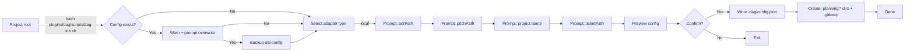

# 2026-05-16: Guided initialization flow for DAG plugin

## Problem

Installing the DAG plugin requires users to manually create `.dag/config.json` with the correct structure. No guided setup, no defaults, no validation. First experience is "go read the README and hand-edit JSON." Friction scales with each new adapter type.

## Appetite

Small (1-2 weeks). Config scaffolding is a bounded standalone problem. Plugin installation/registration is deferred.

## Solution Outline

A bash script (`plugins/dag/scripts/dag-init.sh`) that interactively scaffolds `.dag/config.json` and creates the `.planning/` directory structure. Run from the project root; answers a few prompts with sensible defaults; previews the config; writes it atomically with automatic backup of any existing config.

## Breadboard

| Place | Affordances | Connects to |
|-------|-------------|-------------|
| Terminal | Run `dag-init.sh` | Config check |
| Config check | Warn if exists, offer overwrite + auto-backup | Select adapter |
| Select adapter | Choose `local` (only option in v1) | Prompt sequence |
| Prompt sequence | Answer path questions with sensible defaults | Preview |
| Preview | Show generated JSON, confirm/cancel | Write or Exit |
| Write | Scaffold config + `.planning/*/` dirs + `.gitkeep` files | Done |
| Done | Print paths + next steps | — |

**Key decisions**:
- Pure bash script at `plugins/dag/scripts/dag-init.sh` — no slash command, no AI orchestration
- Interactive prompts with sensible defaults: `adrPath=./.planning/adr`, `pitchPath=./.planning/pitches`, `ticketPath=./.planning/tickets`, project name from `basename $(pwd)`
- If config exists: "An existing config was found at `.dag/config.json`. Overwrite? It will be backed up to `.dag/config.json.bak`. [Y/n]"
- Creates `.planning/adr/.gitkeep`, `.planning/pitches/.gitkeep`, `.planning/tickets/.gitkeep` so directories are committed
- Validates paths are relative and non-empty
- Idempotent — no partial state (writes to `mktemp` tempfile, moves atomically on confirm)
- Tool-agnostic — identical behavior for Claude Code and OpenCode
- Target bash 3+ (macOS default), POSIX-safe constructs

## Engineering notes

- Script location: `plugins/dag/scripts/dag-init.sh`
- Uses POSIX `read -p` for prompts, `case` for adapter dispatch (extensible when cloud adapters arrive)
- Defaults reference the local adapter's own defaults from `config.schema.json`
- `mkdir -p` handles all directory creation; `touch` creates `.gitkeep` files

## No-gos

- No plugin installation or registration (no curl-to-bash, no marketplace interaction)
- No Claude Code vs OpenCode detection
- No cloud adapter scaffolding (`local` only in v1)
- No headless/CI mode (interactive only)
- No migration from old config backups (`.bak` is a safety net, not a migration path)
- No post-scaffold verification (e.g., does the pipeline actually run?)

## Rabbit holes

- **Future adapter extensibility** — deferred. V1 hardcodes `local`. When cloud adapters exist, extend with a `select adapter` prompt.
- **Partial state on interrupt** — handled via `mktemp` + atomic move.
- **Bash version portability** — no associative arrays, no `[[ ]]`, no arrays. POSIX `read -p`, basic string ops. Test on bash 3.2 (macOS default).
