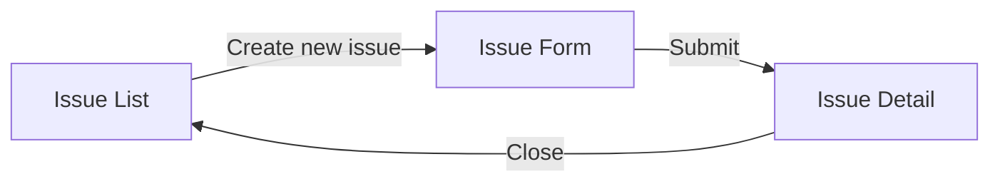

## 1. Input

Accept a feature idea, meeting transcript, meeting notes, or inline description.

If given a **meeting transcript**, identify each speaker by role:
- **Stakeholder** — Who requested or has interest in the work
- **Product** — Who defines the problem and success criteria
- **Engineering** — Who will build it

Note any missing roles. For example: "No Engineering voice present in this discussion. Engineering review may surface scope changes during the building phase."

If no input is provided, ask what the user wants to shape.

## 2. Appetite sizing

Determine the timebox for this work:

| Appetite | Duration |
|----------|----------|
| small | 1-2 weeks |
| medium | 3-4 weeks |
| large | 5-6 weeks |

The appetite constrains the solution — not the other way around. Steer the user away from estimating tasks. Instead, ask: "How much time is this idea worth to the business?" If the solution doesn't fit the appetite, the solution needs to shrink, not the appetite grow.

## 3. Shape the pitch

Walk through each section of the pitch with the user. Be conversational — ask questions, propose options, iterate. Reference [pitch-structure.md](pitch-structure.md) for section details.

### 3.1 Breadboarding

Use a breadboard to sketch the solution. A breadboard has three elements:

- **Places** — Screens, views, or states the user moves through
- **Affordances** — Actions or controls available in each place
- **Connections** — How places link together (navigation, data flow)

Represent the breadboard in two forms:

1. **Mermaid flowchart** — A diagram of places, affordances, and connections
2. **Plain-text table** — A human-readable fallback in case the adapter or document viewer doesn't render Mermaid

Example:



| Place | Affordances | Connects to |
|-------|-------------|-------------|
| Issue List | Create new issue, Filter, Select | Issue Form |
| Issue Form | Submit, Cancel | Issue Detail |
| Issue Detail | Close, Reopen, Edit | Issue List |

### 3.2 Engineering notes

Capture technical points that are too implementation-focused for the Solution section. These guide engineering during building but don't belong in the solution outline:

- Data model considerations
- API endpoint structure
- Performance constraints
- Integration points with existing systems
- Migration or rollout strategy

Engineering notes are optional and can be filled in later by engineering review.

## 4. Open questions

Track unresolved items throughout the shaping session. Each open question should identify:

- What needs to be resolved
- Who needs to weigh in
- Any blocking relationships to other sections

Open Questions block status from advancing to `shaped`. All must be resolved first.

## 5. Title convention

Use this format for the pitch title:

```
YYYY-MM-DD: Brief description
```

The adapter generates the filename from the title slug, so this produces filenames like `2026-05-14-foo-bar.md`.

## 6. Status validation

The pitch has a `status` frontmatter field that follows this lifecycle:

```
shaping → shaped → building → done
                 ↘ shelved
```

### Gates

| From | To | Gate |
|------|----|------|
| `shaping` | `shaped` | All required sections populated (Problem, Appetite, Solution, No-gos). Rabbit holes resolved — either explicitly "none" or risks documented with workarounds (derisked). All Open Questions resolved. Ask approval before changing. |
| `shaped` | `building` | Status is `shaped`. Ask approval before changing. |
| Any | `shelved` | No gate. Ask confirmation. |
| `shaped` | `shaping` | Always allowed (iteration). |
| Any other transition | — | Ask the user. Missing sections? Unresolved questions? Default to `shaping`. |

### Before publishing

Check the current status against the gates above. If the gate isn't met, report what's missing and ask the user how to proceed. Publication is always allowed — missing items are called out in the published doc but don't block publication. They block status promotion.

## 7. Review

Present the full pitch draft to the user. Call out:

- Any missing sections
- Any unresolved open questions
- The current status
- Who else may need to review (especially if Engineering was absent from the shaping session)

## 8. Publish

Publish the pitch using the documentation adapter:

1. Read `.docs-driven/config.json` to find the configured documentation adapter
2. Read the adapter's publish instructions from `plugins/shared/adapters/documentation/{type}.md`
3. Construct the publish content using the contract:
   - `type`: `pitch`
   - `title`: The pitch title (from Section 5)
   - `body`: Full pitch content in markdown
   - `metadata`: object with `status`, `date`, `tags`

If any sections are missing or open questions exist, use the placeholder format defined in [pitch-structure.md](pitch-structure.md) (the `When incomplete` note for each section). This keeps the structure navigable while clearly marking what's unfinished. Do NOT silently omit missing sections.

## 9. When you are done

Do not implement the solution. Do not create tickets. Do not advance status past `shaped` without approval.
