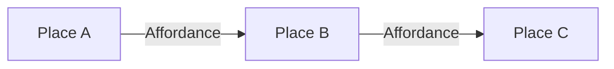

# Pitch structure

A Shape Up pitch documents a shaped project proposal. This reference defines the standard sections and frontmatter fields.

## Frontmatter

| Field | Required | Description |
|-------|----------|-------------|
| `status` | yes | One of: `shaping`, `shaped`, `building`, `done`, `shelved` |
| `date` | yes | Date the pitch was published or last updated (ISO 8601) |
| `tags` | no | List of labels for categorization |

## Sections

### Problem

Describe the opportunity or pain point being addressed. What is the current situation, and why does it need to change? If this is a feature request, what is the trigger or use case?

**Required for `shaped`**: yes
**When incomplete**: `_TO DO: Define the problem statement — who needs this, what's the current pain point, and why now?_`

---

### Appetite

The timebox allocated for this work. Choose one:

| Appetite | Duration |
|----------|----------|
| small | 1-2 weeks |
| medium | 3-4 weeks |
| large | 5-6 weeks |

Include the rationale: why this size? What's the cost of waiting or the value of shipping sooner?

**Required for `shaped`**: yes
**When incomplete**: `_TO DO: Determine the appetite — small (1-2 weeks), medium (3-4 weeks), or large (5-6 weeks)?_`

---

### Solution Outline

A concise summary (2-4 sentences) describing what will be built. Not a spec — this is the shaped solution that fits within the appetite. Covers the approach at a high level without diving into places, affordances, or implementation detail.

**Required for `shaped`**: yes
**When incomplete**: `_TO DO: Write a summary of the approach — what is being built and at a high level, how does it work?_`

---

### Breadboard

The detailed interaction model. Represent it with:

1. **Breadboard diagram** — A Mermaid flowchart showing Places, Affordances, and Connections. Example:

2. **Plain-text table** — Fallback for environments that don't render Mermaid:

| Place | Affordances | Connects to |
|-------|-------------|-------------|
| ... | ... | ... |

3. **Key decisions** — Notable choices that shaped the solution (e.g. "We'll use a single table, not a separate service").

**Required for `shaped`**: yes
**When incomplete**: `_TO DO: Sketch the breadboard — what places, affordances, and connections exist? What are the key decisions?_`

---

### Engineering notes

Technical implementation guidance that's too detailed for the Solution Outline or Breadboard. Examples:

- Data model or schema decisions
- API contract notes
- Performance or scalability considerations
- Migration or rollout approach
- Integration points with existing systems

These may be filled by engineering during a later review phase.

**Required for `shaped`**: no
**When incomplete**: `_TO DO: Add engineering guidance during review (optional)._`

---

### Rabbit holes

Risks, unknowns, or gotchas that could derail the work. Each rabbit hole should be documented with:

- What the risk is
- How it was derisked or the planned workaround
- Or explicitly state "none" if none identified

If no rabbit holes exist, state that explicitly.

**Required for `shaped`**: yes — either "none" or documented risks with workarounds (derisked)
**When incomplete**: `_TO DO: Identify rabbit holes — what could go wrong? Or explicitly state none identified._`

---

### No-gos

What is explicitly out of scope. Boundaries prevent scope creep during building. Be specific:

- What won't be built
- What won't be supported
- What's deferred to a future iteration

**Required for `shaped`**: yes
**When incomplete**: `_TO DO: Define boundaries — what is explicitly out of scope?_`

---

### Open Questions

Unresolved items that came out of the shaping session. Each should include:

- The question or decision needed
- Who needs to answer it

**Resolution pattern**: When an open question is resolved, move the decision into the relevant section (Problem, Solution Outline, Breadboard, No-gos, etc.) and remove the entry from Open Questions. Do not keep resolved questions here — this section tracks only unresolved items.

All open questions must be resolved before status can advance to `shaped`.

**Required for `shaped`**: no — but must be empty (all resolved)
**When incomplete**: `_TO DO: Record unresolved questions and who needs to answer them._`
